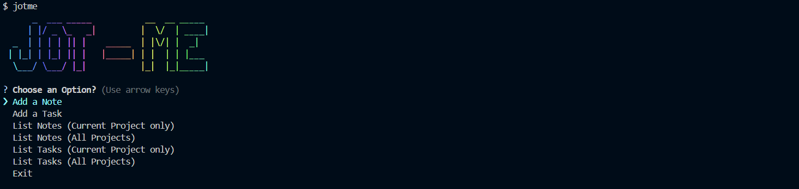

# Jotme


**JotMe** is a powerful and easy-to-use command-line tool designed to help you manage your notes and tasks for projects. 

It allows you to store and manage notes at the project level, making it easy to filter and access them globally. Whether you are working on personal projects or collaborating with a team, jotMe provides an intuitive way to organize and track your progress.

---


## Features

- **Project-Level Notes**: Store notes specifically for a project, which can later be filtered and accessed globally for better project management.
  
- **Task Management**: Record tasks performed during a project, helping you track what’s been done and what still needs attention.
  
- **Git Integration**: If your project has a Git repository, jotMe can automatically commit tasks and notes to your repo, making it easy to keep everything version-controlled.
  
- **Color-Themed UI**: The tool is designed with a beautiful and engaging color theme for a more attractive and user-friendly experience in the terminal.

---

## Installation

To install **jotMe** globally on your machine, run the following command in your terminal:

```bash
npm install -g jotme
```

## Usage

Once installed, you can use **jotMe** to manage your notes and tasks for your projects. Below are a few examples of common commands:

### Show Main Menu:

```bash
jotme
```
### Add a Note:

```bash
jotme add -n "This is a note for my project."
```
### Add a Task and commit it to repo:

```bash
jotme add -t "This is a task for my project."
```
### List all Notes (Only for current Project):

```bash
jotme list -n
```
### List all Tasks (Only for current Project):

```bash
jotme list -t
```

<!-- ## Contributing

Please read [CONTRIBUTING.md](CONTRIBUTING.md) for details on our code of conduct, and the process for submitting pull requests to us.

1.  Fork it!
2.  Create your feature branch: `git checkout -b my-new-feature`
3.  Add your changes: `git add .`
4.  Commit your changes: `git commit -am 'Add some feature'`
5.  Push to the branch: `git push origin my-new-feature`
6.  Submit a pull request :sunglasses: -->


## Built With

<!--  -->
* Node.js
<!-- <i class="fa-brands fa-node"></i> -->

## Authors

* **Suryash Kumar Jha** - *Initial work* - [Suryash-Jha](https://github.com/suryash-jha)

See also the list of [contributors](https://github.com/suryash-jha/jotme/contributors) who participated in this project.


